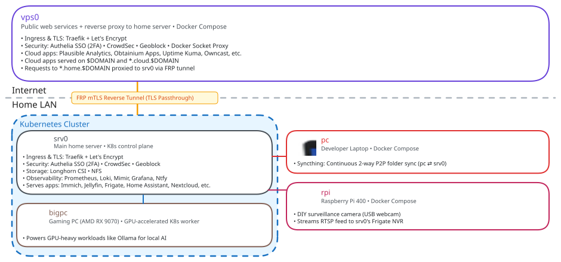

# Infra

The IaaC system for my homelab and other devices.

## Architecture

- `vps0` is a cloud VPS that uses Docker Compose to run public-facing services like [`apps.obtainium.imranr.dev`](https://apps.obtainium.imranr.dev/) and tunnel some requests through to `srv0`.
- `srv0` is a lightweight home server that uses Kuberetes (K3s) to run personal services like [Immich](https://immich.app/).
- `bigpc` is a gaming PC that also serves as a Kubernetes worker node for GPU-accelerated workloads like [Ollama](https://ollama.com/).
- `pc` is a laptop that runs [Syncthing](https://syncthing.net/) (via Docker Compose) to sync files to `srv0`.
- `rpi` is an SBC that streams a live camera feed to [Frigate](https://frigate.video/) on `srv0`.

<p align="center">
  
</p>

- Services exposed to the internet through Traefik are protected by [Authelia SSO](https://www.authelia.com/), [Crowdsec](https://www.crowdsec.net/), and [geoblock](https://plugins.traefik.io/plugins/62d6ce04832ba9805374d62c/geo-block).
- Everything is updated through [Renovate](https://www.mend.io/renovate/) (run daily on a schedule from `srv0`; review/merge the PRs it opens).

## Project Goals

- **Infrastructure as Code**: Everything should be declarative and automated, using standard tooling wherever possible. Custom scripts should be minimal and only where necessary.
- **Single CLI**: `ansible-playbook` is the only entry point — generic ops against the committed inventory with `-l <target>`, target-specific ops via `targets/<t>/playbooks/` (host hardcoded).
- **Security**: As the codebase is public and the system runs public-facing services containing highly personal data, security must be taken seriously.

## Quick start

```bash
# Install prerequisites (Docker, yq, jq, python3, python3-dotenv, go, ansible-core, helm) — an Ansible playbook
# (if ansible-playbook itself is missing, bootstrap it first: sudo dnf|apt install ansible-core)
ansible-playbook ops/ansible/playbooks/prereqs.yml

# Create your variables file from the template (dotenv format)
cp targets/<target>/VARS.template.env secrets/VARS.<target>.env
# Edit secrets/VARS.<target>.env with your secrets and settings
# srv0 k3s: helm values live in secrets/values.srv0.yaml (keys documented in VARS.template.env)

# Validate your configuration
ansible-playbook ops/ansible/playbooks/validate.yml -l <target>

# Deploy compose / k3s
ansible-playbook ops/ansible/playbooks/compose_install.yml -l <target>
ansible-playbook targets/srv0/playbooks/helm_apply.yml -e helm_scope=base
ansible-playbook targets/srv0/playbooks/helm_apply.yml -e helm_scope=apps

# Check for updates (opens Renovate PRs on GitHub)
ansible-playbook ops/ansible/playbooks/renovate.yml
```

Extra vars ride `-e key=value`; `--check` dry-runs everything. Run playbooks from the repo root (roles/inventory paths in `ops/ansible/ansible.cfg` are config-relative).

## K3s node provisioning (Ansible)

Node provisioning is declarative Ansible ([`ops/ansible/`](ops/ansible/)). There is **no inventory file for provisioning**: `k3s_join.yml` builds its node host at runtime via `add_host`, so any node can become the control plane and any node can join in any role. Cluster policy defaults (SELinux, `write-kubeconfig-mode: "0640"`, `flannel-backend: wireguard-native`, sysctls, firewall ports, node labels) live in the roles' `defaults/main.yml`.

Prerequisites on the control host only (not on the nodes being provisioned): `ansible-playbook ops/ansible/playbooks/prereqs.yml` — bootstraps ansible-core via the package manager first — installs the required collections (`ansible.posix`, `community.general`) and the validation tools (`ansible-lint`, `yamllint`). Manual alternative:

```bash
dnf install ansible-core
ansible-galaxy collection install -r ops/ansible/requirements.yml
```

Bootstrap a control plane — run **on** the node (it downloads the official `get.k3s.io` installer, verifies its SHA256 against GitHub's `main` install.sh — fail-closed, overridable with `k3s_installer_sha256` — writes config drop-ins, firewall, sysctls, kubectl group, labels):

```bash
ansible-playbook ops/ansible/playbooks/k3s_server.yml
```

Join a worker (run **on** the control plane; the token is read locally and passed to the installer via environment only — never argv, disk, or logs):

```bash
ansible-playbook ops/ansible/playbooks/k3s_join.yml -e node_ip=192.168.1.50 -e node_user=myuser -e k3s_role=agent
# or join another server: ... -e k3s_role=server
# AMD GPU: -e k3s_amdgpu_mode=auto (lspci-detected) | yes | no
# other flags: -e k3s_scheduling_discouraged=true, -e k3s_longhorn_replicas=true, --check, --diff
```

Update a node IP after a network change (run **on** srv0; retained bash implementation behind the playbook):

```bash
ansible-playbook targets/srv0/playbooks/update_node_ip.yml -e update_node_ip=192.168.1.51
```

Validate the provisioning playbooks without touching any hosts: `ansible-playbook --syntax-check ops/ansible/playbooks/*.yml` + `yamllint -c ops/ansible/.yamllint ops/ansible` + `ansible-lint -c ops/ansible/.ansible-lint --offline ops/ansible`.

Dry-run on a test VM (Multipass): `multipass launch -n testnode fedora`, SSH in, copy the repo, run the prereqs playbook, then `ansible-playbook ops/ansible/playbooks/k3s_server.yml --check --diff` before the real run. Re-running it on an installed node is a no-op (it never re-runs the installer, so it can't fight system-upgrade-controller's version ownership).

## Migrating from the old `./infra.sh` CLI

`./infra.sh` (and the bash dispatcher behind it) was replaced by `task` + a Python VARS validator, then by plain `ansible-playbook` as the single CLI. VARS files are dotenv (`VARS.*.env`); the old bash K3s provisioning (`k3s:setup` / `k3s:join`) was replaced by the Ansible playbooks described above. See `git log` for the intermediate Task-based layout.

## More

Detailed documentation lives in [AGENTS.md](AGENTS.md). Note that while LLMs are used in development, the LLM isn't the one putting its data on the line. [It is just a tool](https://www.normaltech.ai/p/ai-as-normal-technology) and is used like one.
